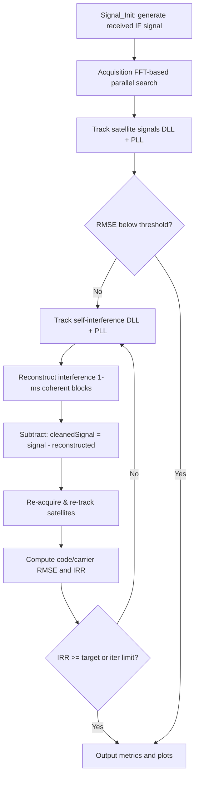

# Same-Frequency Self-Interference Cancellation (SIC) Simulation Platform

**A MATLAB simulation platform for self-interference cancellation in co-time co-frequency full-duplex (CCFD) GNSS receivers — implemented and verified on BDS B2a / GPS L5 signals.**


---

## 1. Overview

In a CCFD GNSS receiver, the local transmit signal leaks into the receive chain and acts as a **strong self-interference** that far exceeds the weak satellite signals (typically by 30 dB or more), severely degrading acquisition and tracking performance.

This project provides a complete end-to-end MATLAB software simulation that:

1. Generates a realistic received IF signal (3 weak satellite signals + AWGN + a multipath self-interference signal).
2. Performs **acquisition** (FFT-based parallel code phase search over a Doppler frequency grid).
3. Performs **tracking** of both satellite and interference signals using DLL/PLL loops.
4. **Reconstructs** the self-interference from its tracked code/carrier/amplitude parameters and **subtracts** it from the received signal.
5. **Iterates** the cancellation loop and reports key performance metrics:
   - Code phase RMSE (chips)
   - Carrier phase RMSE (π rad)
   - Interference Rejection Ratio — **IRR (dB)**

A graphical user interface (MATLAB App Designer) is included for easy demo and visualization.

---

## 2. Features

- 🛰️ **BDS B2a pilot signal** — main code, code rate 10.23 MHz, code length 10230 chips (same band as GPS L5, carrier 1176.45 MHz).
- 📡 **FFT-based acquisition** — parallel code-phase search over ±1600 Hz Doppler bins (200 Hz steps).
- 🔄 **Code/carrier tracking loops** — 2nd-order DLL + PLL with configurable noise bandwidth and damping ratio.
- 🧹 **Iterative self-interference cancellation** — reconstructs and subtracts the interference with a configurable IRR target (default ≥ 10 dB, max 3 iterations).
- 📊 **Quantitative evaluation** — code phase RMSE, carrier phase RMSE, and IRR are computed and displayed.
- 🖥️ **Interactive GUI** — one-click run, time-domain waveform comparison and IQ constellation plots (I/Q components) of the original / reconstructed / residual interference.
- 🎛️ **Configurable scenarios** — satellite count, Doppler, power levels, multipath delays of the interference, band-limited or not, etc.

---

## 3. Algorithm Flow



**Cancellation principle:** the self-interference is treated as a strong "signal" whose code phase, carrier frequency and amplitude are tracked accurately; a local replica is reconstructed per 1 ms coherent integration block and subtracted from the received samples. After subtraction, the residual interference energy is measured to compute the IRR:

```
IRR (dB) = 10 * log10( P_interference_before / P_interference_after )
```

The loop repeats until the accumulated IRR reaches the target threshold (default 10 dB) or the maximum iteration count (default 3) is reached.

---

## 4. Directory Structure

```
SIC/
├── Interface.m                  # Main GUI (App Designer class)
├── SubInterface.m               # Plotting sub-GUI (waveform + IQ components)
├── Signal_Init.m                # Simulation signal generation (script)
├── Interference_Cancellation.m  # Core cancellation pipeline (script)
├── plot_result.m                # Standalone plotting script (optional)
├── app/
│   ├── app1.mlapp               # Main GUI project file
│   └── app2.mlapp               # Plotting GUI project file
└── include/
    ├── BPSK_Acquisition.m       # FFT-based acquisition
    ├── BPSK_Tracking.m          # Satellite signal tracking (DLL/PLL)
    ├── Interference_Tracking.m  # Interference tracking & reconstruction
    ├── BPSK_SigRecGenerator.m   # BPSK IF signal generator
    ├── AcqResult.m              # Acquisition post-processing (Doppler, delay)
    ├── B2aCodeGen_MainCode.m    # B2a pilot main code generator
    ├── B2aCodeGen_SubCode.m     # B2a sub-code generator
    ├── B2aLocalGen.m            # Local B2a replica generator
    ├── B2aSigGen.m              # B2a baseband signal generator
    ├── calcLoopCoef.m           # Loop filter coefficients (from SoftGNSS)
    ├── CNoVSM.m                 # C/N0 estimation (variance-sum method)
    ├── limit_amplitude.m        # Outlier clipping / limiting
    ├── max_xcorr.m              # Maximum normalized cross-correlation
    ├── plot_complex_signal.m    # IQ 4-component plotting
    ├── plot_complex_signal_inapp.m  # IQ plotting inside the App
    └── logo.jpg
```

---

## 5. Requirements

| Component                 | Version / Note                       |
| ------------------------- | ------------------------------------ |
| MATLAB                    | R2016a+ (recommended R2020a+)        |
| Signal Processing Toolbox | required (`fir1`, `filter`, `xcorr`) |
| App Designer              | required for GUI mode                |

---

## 6. Quick Start

### Option A — GUI mode (recommended for demo)

1. In MATLAB, add the project root to the path (the `include/` folder will be resolved automatically if the whole `SIC` folder is added):
   ```matlab
   addpath(genpath('path/to/SIC'));
   ```
2. Run the main interface:
   ```matlab
   Interface
   ```
   or open `app/app1.mlapp` and press **Run**.
3. Click **「启动」 (Start)** — the simulation runs automatically:
   - signal generation → acquisition → tracking → interference cancellation (iterative) → evaluation;
   - the code phase RMSE, carrier phase RMSE and IRR (dB) are shown in the panel.
4. Click **「结果绘图」 (Plot)** to open the plotting sub-window with:
   - time-domain waveform comparison (original vs reconstructed interference);
   - I/Q component plots of the original, reconstructed, and residual interference.

### Option B — Script mode

```matlab
addpath(genpath('path/to/SIC'));
Signal_Init;                 % generate the received IF signal
Interference_Cancellation;   % run acquisition → tracking → cancellation
```

Optionally run `plot_result.m` afterwards to plot the waveform comparison.

> **Note:** the scripts share variables via the base workspace. Always run `Signal_Init` first so that `InterFreqSignal`, `Interference`, and `General_settings` exist before running `Interference_Cancellation`.

---

## 7. Simulation Setup (default scenario)

| Parameter                  | Value                                                                         |
| -------------------------- | ----------------------------------------------------------------------------- |
| Carrier frequency (B2a/L5) | 1176.45 MHz                                                                   |
| Intermediate frequency     | 0 Hz (zero-IF)                                                                |
| Sampling frequency         | 50 MHz                                                                        |
| Signal duration            | 501 ms                                                                        |
| Code rate / code length    | 10.23 MHz / 10230 chips (B2a pilot main code)                                 |
| Noise PSD                  | −232 dBW/Hz                                                                   |
| Satellite signals          | PRN 1/2/3, power −155 dBW, Doppler 0 / +1000 / −1000 Hz                       |
| Self-interference          | PRN 4, 3 multipath taps, delays 5 / 10 / 15 ns, powers −125 / −140 / −155 dBW |
| Band-limit filter          | FIR low-pass, cutoff 15 MHz, order 100 (optional)                             |
| Acquisition search         | ±1600 Hz, 200 Hz step (17 frequency bins)                                     |
| DLL                        | noise bandwidth 2 Hz, damping 0.7, correlator spacing 0.5 chip                |
| PLL                        | noise bandwidth 10 Hz, damping 0.7                                            |
| Cancellation target        | IRR ≥ 10 dB, max 3 iterations                                                 |

All parameters can be tuned in `Signal_Init.m` (scenario) and `Interference_Cancellation.m` (loops & iteration policy).

---

## 8. Performance Metrics

After the cancellation pipeline finishes, the following metrics are displayed in the GUI and printed in the command window:

- **Code phase RMSE** (chips) — tracking accuracy of the desired satellite after cancellation;
- **Carrier phase RMSE** (π rad) — carrier tracking accuracy after cancellation;
- **IRR** (dB) — interference rejection ratio, i.e. how much the self-interference power has been suppressed.

A typical run reports a code phase RMSE well below 0.005 chips and an accumulated IRR above the 10 dB target within the iteration budget, which restores the acquisition/tracking of the desired signals corrupted by strong self-interference.

---

## 9. Acknowledgements

- The B2a ranging code generation follows the BDS B2a ICD (BeiDou Navigation Satellite System Signal In Space Interface Control Document, BDS-SIS-ICD-B2a).

---

## 10. License

The project is intended for research and educational purposes.


---

